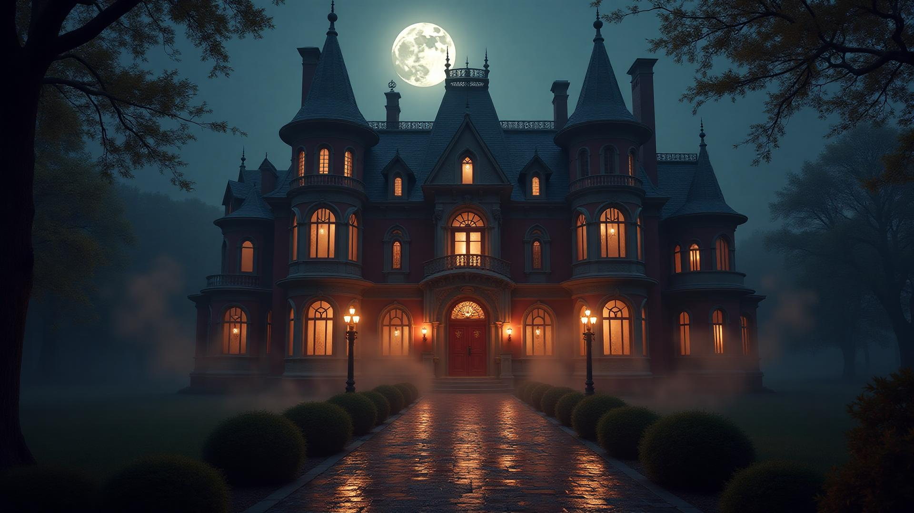

# The Founder's Ball - A Mystic Falls Halloween Experience

An interactive Halloween-themed web application that takes users on a personalized journey through the supernatural world of Mystic Falls. Choose your attire, find your dance partner, and discover your true supernatural identity at the legendary Founder's Ball.

This project is part of [Frontend Challenge: Halloween Edition](https://dev.to/challenges/frontend-2025-10-15)

## Features

- **Interactive Storytelling**: Make choices that shape your unique Mystic Falls experience
- **Elegant Design**: Gothic, dark-themed UI inspired by The Vampire Diaries
- **Smooth Transitions**: Seamless section-by-section navigation with fade animations
- **Responsive Layout**: Fully optimized for desktop, tablet, and mobile devices
- **Personalized Story**: Generate a custom narrative based on your selections
- **Random Identity Reveal**: Discover your supernatural nature through chance

## User Journey

1. **Landing Page** - Enter the atmospheric world of Mystic Falls
2. **Choose Attire** - Select between Men's or Women's formal wear
3. **Select Outfit** - Pick from 4 elegant ball gowns or suits
4. **Find Your Partner** - Choose your mysterious dance companion
5. **Reveal Identity** - Discover if you're a Vampire, Human, Healer, Werewolf, or Angel
6. **Your Story** - Read your personalized Mystic Falls tale

##  Technologies Used

### Frontend
- **HTML5** - Semantic markup structure
- **CSS3** - Custom styling with gradients, animations, and flexbox/grid layouts
- **Vanilla JavaScript (ES6+)** - Interactive functionality and DOM manipulation

### Design
- **Custom Animations** - CSS keyframes for smooth transitions
- **Responsive Design** - Mobile-first approach with media queries

### Architecture
- **Modular JavaScript** - ES6 modules for clean code organization

